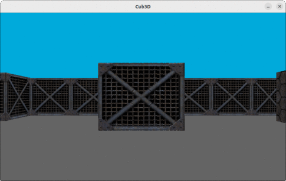

# Cub3d
**Cub3d** is a project we tackled together at 42 School. Our goal? To build a program that lets you explore dynamic 3D mazes, just like you would in a classic first-person shooter game! To achieve this, we used a special coding technique called **raycasting**.



## The Art of Raycasting: Simulating Light's Journey

At its core, cub3d utilizes the powerful technique of raycasting. Imagine yourself standing in the maze, a starting point for numerous invisible rays shooting outwards in all directions. These rays represent light beams traveling through the environment. As these rays encounter walls, they are blocked, revealing the layout of the maze around you. Here's a breakdown of the raycasting process:

- **Camera and Direction:** cub3d defines your viewpoint within the maze using a camera position and direction vector. Based on this information, it calculates the starting point and direction for each ray that will be cast into the scene.
- **Digital Space Discretization:** The maze world is represented digitally, typically as a two-dimensional grid of cells. This grid defines the presence or absence of walls at specific locations.
- **Ray-Wall Intersection:** The heart of raycasting lies in efficiently determining the point where a ray intersects a wall. cub3d employs algorithms like the Digital Differential Analyzer (DDA) to calculate the intersection point efficiently, considering both horizontal and vertical wall segments.
- **Distance Calculation:** Once the intersection point for a ray is found, cub3d calculates the distance from your viewpoint (camera) to the intersection. This distance plays a crucial role in determining the shading and perspective of the wall segment on the screen.
- **Field-of-View:** cub3d restricts the number of rays cast to a specific field-of-view, simulating human vision and focusing on the area in front of you.

**Built with MiniLibX:** To make everything run smoothly and display the maze on your screen, we used a helpful library called MiniLibX. 
This library handles things like creating windows and drawing graphics, letting us focus on the core raycasting logic of cub3d

## Running the program
- clone the repo
  ```
  git clone https://github.com/Alaire1/Cub3D_42.git
  ```
- go to the directory and compile program with
  ```
  make
  ```
- run program with selected map
  ```
  ./cub3d maps/map.cub
  ```
##  Breakdown of the Cub3D Map Elements:
```
NO ./textures/tile357.xpm
SO ./textures/tile357.xpm
WE ./textures/tile357.xpm
EA ./textures/tile356.xpm


F 100,100,100
C 0,170,219

    11111111111111
    1100000N00000111
   111111111111111
11111
```
This map snippet defines a small maze-like section for your Cub3D game. Here's a breakdown of the elements:

### Texture Definitions:
These lines define the textures used for the walls.
```
NO ./textures/tile357.xpm
```
Specifies the north wall texture located in the file **./textures/tile357.xpm.**
Similar lines define textures for east **(EA)**, west **(WE)**, and south **(SO)** walls.

### Floor and Ceiling Colors:
```
F 100,100,100
```
This line sets the floor color to a light gray with equal parts red, green, and blue (all values at 100).
```
C 0,170,219
```
This line sets the ceiling color to a dark blue with a mix of red (0), green (170), and blue (219).

### Map Layout:
This section defines the actual layout of the map using symbols:
- **1** Represents a wall.
- **0** Represents empty space.
- **N** Represents the player's starting position facing North. In this case, the player starts at the center of the bottom wall.

### Key Points:
- The map is enclosed by walls, preventing the player from going out of bounds.
- The map doesnt have to be any certain shape as long all of the elments are connected and the first rule is satisfied
- Map has to have only one player

## Controls
Controls for movement and rotation are:

- **W**: move forward
- **S**: move backward
- **A**: strafe left
- **D**: strafe right
- **left arrow**: rotate left
- **right arrow**: rotate right
  
## Useful links
- **Minilibx:** [hsmits MiniLibX documentation](https://harm-smits.github.io/42docs/libs/minilibx)
- **Ray Casting tutorial:** [tutorial](https://permadi.com/1996/05/ray-casting-tutorial-table-of-contents/)
